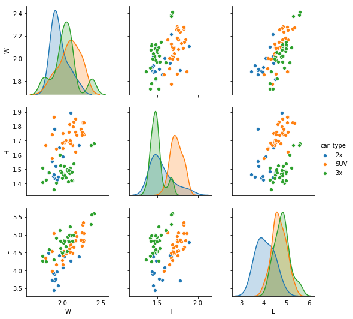
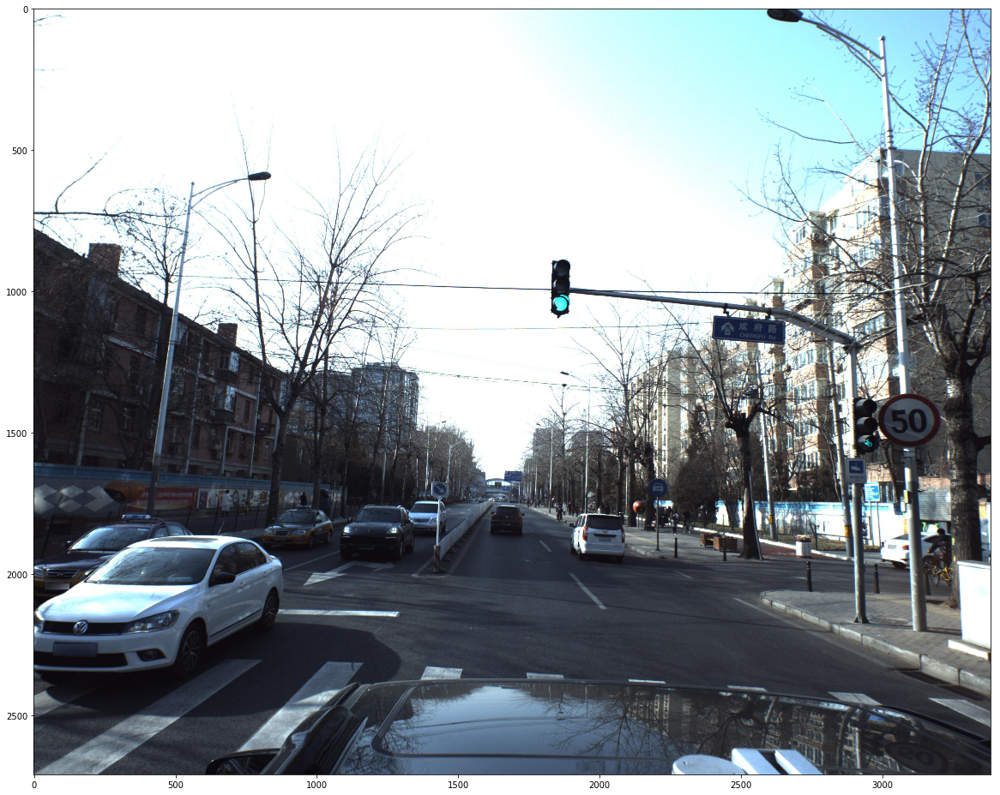
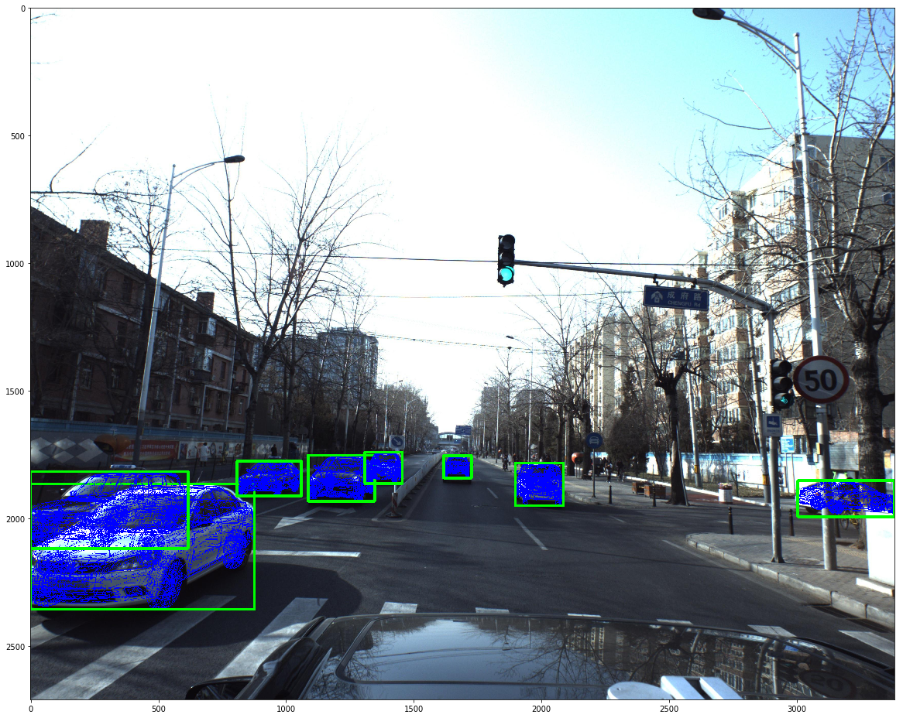

# pku baidu kaggle dataset api

## Augmented test images
Out of the test images some are flipped. These are annotated and saved to [data folder](data).

## average size
```python
{'2x': {'W': 1.81794264,
  'H': 1.47786305,
  'L': 4.49547776,
  'model': 'bieke-yinglang-XT'},
 'SUV': {'W': 2.10604523,
  'H': 1.67994469,
  'L': 4.73350861,
  'model': 'biyadi-tang'},
 '3x': {'W': 1.9739563700000002,
  'H': 1.4896684399999998,
  'L': 4.83009344,
  'model': 'dazhongmaiteng'}}  
```



## image and mask renderer
Run the command to render image, and get amodal bboxes.
```
python car_renderer.py
```

Original image


Rendered mask and bbox
